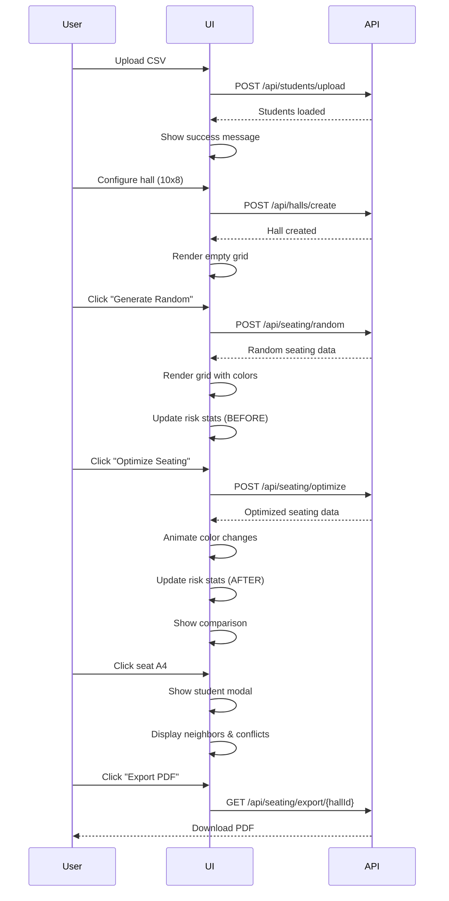

# Frontend UI Design - 3-Panel Layout

## Overview

The frontend provides an interactive visualization of the exam seating optimization system with real-time updates, color-coded risk indicators, and before/after comparison capabilities.

## UI Layout Structure

The interface consists of **3 main panels**:

1. **Left Panel**: Input controls and actions
2. **Center Panel**: Dynamic seat grid visualization
3. **Right Panel**: Risk analytics and legend

## Wireframe: Main Dashboard

```wireframe
<!DOCTYPE html>
<html>
<head>
<style>
* { margin: 0; padding: 0; box-sizing: border-box; }
body { font-family: Arial, sans-serif; background: #f5f5f5; }
.container { display: flex; height: 100vh; gap: 20px; padding: 20px; }

/* Left Panel */
.left-panel { 
  width: 300px; 
  background: white; 
  padding: 20px; 
  border-radius: 8px; 
  box-shadow: 0 2px 8px rgba(0,0,0,0.1);
  overflow-y: auto;
}
.panel-title { 
  font-size: 18px; 
  font-weight: bold; 
  margin-bottom: 20px; 
  color: #333;
}
.form-group { margin-bottom: 15px; }
.form-group label { 
  display: block; 
  margin-bottom: 5px; 
  font-size: 14px; 
  color: #555;
}
.form-group input, .form-group select { 
  width: 100%; 
  padding: 8px; 
  border: 1px solid #ddd; 
  border-radius: 4px;
}
.btn { 
  width: 100%; 
  padding: 10px; 
  margin-top: 10px; 
  border: none; 
  border-radius: 4px; 
  cursor: pointer; 
  font-size: 14px;
  font-weight: 500;
}
.btn-primary { background: #2196F3; color: white; }
.btn-success { background: #4CAF50; color: white; }
.btn-warning { background: #FF9800; color: white; }
.btn-secondary { background: #757575; color: white; }
.divider { 
  height: 1px; 
  background: #e0e0e0; 
  margin: 20px 0; 
}

/* Center Panel */
.center-panel { 
  flex: 1; 
  background: white; 
  padding: 20px; 
  border-radius: 8px; 
  box-shadow: 0 2px 8px rgba(0,0,0,0.1);
  overflow: auto;
}
.seat-grid { 
  display: grid; 
  gap: 8px; 
  margin-top: 20px;
  justify-content: center;
}
.seat { 
  width: 50px; 
  height: 50px; 
  border: 2px solid #ddd; 
  border-radius: 4px; 
  display: flex; 
  align-items: center; 
  justify-content: center; 
  cursor: pointer; 
  font-size: 12px;
  transition: transform 0.2s;
}
.seat:hover { transform: scale(1.1); }
.seat-safe { background: #4CAF50; color: white; }
.seat-medium { background: #FFC107; color: #333; }
.seat-high { background: #F44336; color: white; }
.seat-empty { background: #f5f5f5; }

/* Right Panel */
.right-panel { 
  width: 300px; 
  background: white; 
  padding: 20px; 
  border-radius: 8px; 
  box-shadow: 0 2px 8px rgba(0,0,0,0.1);
  overflow-y: auto;
}
.legend-item { 
  display: flex; 
  align-items: center; 
  margin-bottom: 10px; 
}
.legend-color { 
  width: 30px; 
  height: 30px; 
  border-radius: 4px; 
  margin-right: 10px; 
}
.stat-card { 
  background: #f5f5f5; 
  padding: 15px; 
  border-radius: 4px; 
  margin-bottom: 10px; 
}
.stat-label { 
  font-size: 12px; 
  color: #757575; 
  margin-bottom: 5px; 
}
.stat-value { 
  font-size: 24px; 
  font-weight: bold; 
  color: #333; 
}
.comparison { 
  display: flex; 
  justify-content: space-between; 
  margin-top: 10px; 
}
.comparison-item { text-align: center; }
.comparison-label { 
  font-size: 11px; 
  color: #757575; 
}
.comparison-value { 
  font-size: 18px; 
  font-weight: bold; 
}
</style>
</head>
<body>
<div class="container">
  <!-- Left Panel: Input Controls -->
  <div class="left-panel" data-element-id="left-panel">
    <div class="panel-title">📋 Student Input</div>
    
    <div class="form-group">
      <label>Upload CSV File</label>
      <input type="file" accept=".csv" data-element-id="csv-upload">
    </div>
    <button class="btn btn-primary" data-element-id="upload-btn">Upload Students</button>
    
    <div class="divider"></div>
    
    <div class="panel-title">🏛️ Hall Configuration</div>
    
    <div class="form-group">
      <label>Hall ID</label>
      <input type="text" placeholder="e.g., HALL-A" data-element-id="hall-id">
    </div>
    
    <div class="form-group">
      <label>Rows</label>
      <input type="number" placeholder="e.g., 10" data-element-id="hall-rows">
    </div>
    
    <div class="form-group">
      <label>Columns</label>
      <input type="number" placeholder="e.g., 8" data-element-id="hall-cols">
    </div>
    
    <button class="btn btn-success" data-element-id="create-hall-btn">Create Hall</button>
    
    <div class="divider"></div>
    
    <div class="panel-title">⚙️ Actions</div>
    
    <button class="btn btn-warning" data-element-id="random-btn">🎲 Generate Random</button>
    <button class="btn btn-success" data-element-id="optimize-btn">✨ Optimize Seating</button>
    <button class="btn btn-secondary" data-element-id="reset-btn">🔄 Reset</button>
    <button class="btn btn-primary" data-element-id="export-pdf-btn">📄 Export PDF</button>
  </div>
  
  <!-- Center Panel: Seat Grid -->
  <div class="center-panel" data-element-id="center-panel">
    <div class="panel-title">🪑 Seating Arrangement - HALL-A</div>
    
    <div class="seat-grid" style="grid-template-columns: repeat(8, 50px);" data-element-id="seat-grid">
      <!-- Row 1 -->
      <div class="seat seat-safe" data-element-id="seat-0-0">A1</div>
      <div class="seat seat-medium" data-element-id="seat-0-1">A2</div>
      <div class="seat seat-safe" data-element-id="seat-0-2">A3</div>
      <div class="seat seat-high" data-element-id="seat-0-3">A4</div>
      <div class="seat seat-safe" data-element-id="seat-0-4">A5</div>
      <div class="seat seat-medium" data-element-id="seat-0-5">A6</div>
      <div class="seat seat-safe" data-element-id="seat-0-6">A7</div>
      <div class="seat seat-safe" data-element-id="seat-0-7">A8</div>
      
      <!-- Row 2 -->
      <div class="seat seat-medium" data-element-id="seat-1-0">B1</div>
      <div class="seat seat-safe" data-element-id="seat-1-1">B2</div>
      <div class="seat seat-safe" data-element-id="seat-1-2">B3</div>
      <div class="seat seat-medium" data-element-id="seat-1-3">B4</div>
      <div class="seat seat-safe" data-element-id="seat-1-4">B5</div>
      <div class="seat seat-safe" data-element-id="seat-1-5">B6</div>
      <div class="seat seat-high" data-element-id="seat-1-6">B7</div>
      <div class="seat seat-medium" data-element-id="seat-1-7">B8</div>
      
      <!-- Row 3 -->
      <div class="seat seat-safe" data-element-id="seat-2-0">C1</div>
      <div class="seat seat-safe" data-element-id="seat-2-1">C2</div>
      <div class="seat seat-medium" data-element-id="seat-2-2">C3</div>
      <div class="seat seat-safe" data-element-id="seat-2-3">C4</div>
      <div class="seat seat-safe" data-element-id="seat-2-4">C5</div>
      <div class="seat seat-medium" data-element-id="seat-2-5">C6</div>
      <div class="seat seat-safe" data-element-id="seat-2-6">C7</div>
      <div class="seat seat-safe" data-element-id="seat-2-7">C8</div>
      
      <!-- Row 4 -->
      <div class="seat seat-safe" data-element-id="seat-3-0">D1</div>
      <div class="seat seat-medium" data-element-id="seat-3-1">D2</div>
      <div class="seat seat-safe" data-element-id="seat-3-2">D3</div>
      <div class="seat seat-safe" data-element-id="seat-3-3">D4</div>
      <div class="seat seat-high" data-element-id="seat-3-4">D5</div>
      <div class="seat seat-safe" data-element-id="seat-3-5">D6</div>
      <div class="seat seat-safe" data-element-id="seat-3-6">D7</div>
      <div class="seat seat-medium" data-element-id="seat-3-7">D8</div>
      
      <!-- Row 5 -->
      <div class="seat seat-empty" data-element-id="seat-4-0">E1</div>
      <div class="seat seat-empty" data-element-id="seat-4-1">E2</div>
      <div class="seat seat-empty" data-element-id="seat-4-2">E3</div>
      <div class="seat seat-empty" data-element-id="seat-4-3">E4</div>
      <div class="seat seat-empty" data-element-id="seat-4-4">E5</div>
      <div class="seat seat-empty" data-element-id="seat-4-5">E6</div>
      <div class="seat seat-empty" data-element-id="seat-4-6">E7</div>
      <div class="seat seat-empty" data-element-id="seat-4-7">E8</div>
    </div>
  </div>
  
  <!-- Right Panel: Analytics -->
  <div class="right-panel" data-element-id="right-panel">
    <div class="panel-title">📊 Risk Analysis</div>
    
    <div class="legend-item">
      <div class="legend-color" style="background: #4CAF50;"></div>
      <div>
        <div style="font-weight: 500;">🟩 Safe</div>
        <div style="font-size: 12px; color: #757575;">No conflicts</div>
      </div>
    </div>
    
    <div class="legend-item">
      <div class="legend-color" style="background: #FFC107;"></div>
      <div>
        <div style="font-weight: 500;">🟨 Medium Risk</div>
        <div style="font-size: 12px; color: #757575;">1 conflict</div>
      </div>
    </div>
    
    <div class="legend-item">
      <div class="legend-color" style="background: #F44336;"></div>
      <div>
        <div style="font-weight: 500;">🟥 High Risk</div>
        <div style="font-size: 12px; color: #757575;">2+ conflicts</div>
      </div>
    </div>
    
    <div class="divider"></div>
    
    <div class="stat-card">
      <div class="stat-label">Total Risk Score</div>
      <div class="stat-value" style="color: #4CAF50;">12.5%</div>
    </div>
    
    <div class="stat-card">
      <div class="stat-label">Violations Count</div>
      <div class="stat-value" style="color: #F44336;">3</div>
    </div>
    
    <div class="stat-card">
      <div class="stat-label">Occupied Seats</div>
      <div class="stat-value">32 / 40</div>
    </div>
    
    <div class="divider"></div>
    
    <div class="panel-title">📈 Before vs After</div>
    
    <div class="comparison">
      <div class="comparison-item">
        <div class="comparison-label">BEFORE</div>
        <div class="comparison-value" style="color: #F44336;">45.2%</div>
      </div>
      <div class="comparison-item">
        <div style="font-size: 24px; color: #4CAF50;">→</div>
      </div>
      <div class="comparison-item">
        <div class="comparison-label">AFTER</div>
        <div class="comparison-value" style="color: #4CAF50;">12.5%</div>
      </div>
    </div>
    
    <div class="stat-card" style="background: #E8F5E9; margin-top: 10px;">
      <div class="stat-label" style="color: #2E7D32;">Risk Reduction</div>
      <div class="stat-value" style="color: #2E7D32;">72.4% ↓</div>
    </div>
  </div>
</div>
</body>
</html>
```

## Wireframe: Student Details Modal

```wireframe
<!DOCTYPE html>
<html>
<head>
<style>
* { margin: 0; padding: 0; box-sizing: border-box; }
body { 
  font-family: Arial, sans-serif; 
  background: rgba(0,0,0,0.5); 
  display: flex; 
  align-items: center; 
  justify-content: center; 
  height: 100vh;
}
.modal { 
  background: white; 
  border-radius: 8px; 
  box-shadow: 0 4px 20px rgba(0,0,0,0.3); 
  width: 400px; 
  padding: 0;
  overflow: hidden;
}
.modal-header { 
  background: #2196F3; 
  color: white; 
  padding: 20px; 
  display: flex; 
  justify-content: space-between; 
  align-items: center;
}
.modal-title { 
  font-size: 20px; 
  font-weight: bold; 
}
.close-btn { 
  background: none; 
  border: none; 
  color: white; 
  font-size: 24px; 
  cursor: pointer; 
}
.modal-body { 
  padding: 20px; 
}
.info-row { 
  display: flex; 
  justify-content: space-between; 
  padding: 12px 0; 
  border-bottom: 1px solid #e0e0e0; 
}
.info-label { 
  font-weight: 500; 
  color: #757575; 
}
.info-value { 
  font-weight: 500; 
  color: #333; 
}
.risk-badge { 
  display: inline-block; 
  padding: 4px 12px; 
  border-radius: 12px; 
  font-size: 14px; 
  font-weight: 500; 
}
.risk-safe { background: #4CAF50; color: white; }
.risk-medium { background: #FFC107; color: #333; }
.risk-high { background: #F44336; color: white; }
.neighbors-section { 
  margin-top: 20px; 
}
.section-title { 
  font-weight: bold; 
  margin-bottom: 10px; 
  color: #333; 
}
.neighbor-item { 
  background: #f5f5f5; 
  padding: 10px; 
  border-radius: 4px; 
  margin-bottom: 8px; 
  display: flex; 
  justify-content: space-between; 
}
.conflict-indicator { 
  color: #F44336; 
  font-weight: bold; 
}
</style>
</head>
<body>
<div class="modal" data-element-id="student-modal">
  <div class="modal-header">
    <div class="modal-title">🪑 Seat Details: A4</div>
    <button class="close-btn" data-element-id="close-modal">×</button>
  </div>
  
  <div class="modal-body">
    <div class="info-row">
      <span class="info-label">Roll Number</span>
      <span class="info-value">2021045</span>
    </div>
    
    <div class="info-row">
      <span class="info-label">Student Name</span>
      <span class="info-value">John Doe</span>
    </div>
    
    <div class="info-row">
      <span class="info-label">Subject</span>
      <span class="info-value">Mathematics</span>
    </div>
    
    <div class="info-row">
      <span class="info-label">Position</span>
      <span class="info-value">Row 0, Col 3</span>
    </div>
    
    <div class="info-row">
      <span class="info-label">Risk Level</span>
      <span class="info-value">
        <span class="risk-badge risk-high">🟥 High Risk</span>
      </span>
    </div>
    
    <div class="info-row">
      <span class="info-label">Risk Score</span>
      <span class="info-value" style="color: #F44336; font-size: 18px;">75%</span>
    </div>
    
    <div class="neighbors-section">
      <div class="section-title">Adjacent Seats (4-directional)</div>
      
      <div class="neighbor-item">
        <div>
          <div style="font-weight: 500;">⬆️ A3 - Jane Smith</div>
          <div style="font-size: 12px; color: #757575;">Mathematics</div>
        </div>
        <span class="conflict-indicator">⚠️ CONFLICT</span>
      </div>
      
      <div class="neighbor-item">
        <div>
          <div style="font-weight: 500;">⬇️ B4 - Mike Johnson</div>
          <div style="font-size: 12px; color: #757575;">Physics</div>
        </div>
        <span style="color: #4CAF50; font-weight: 500;">✓ Safe</span>
      </div>
      
      <div class="neighbor-item">
        <div>
          <div style="font-weight: 500;">⬅️ A3 - Sarah Lee</div>
          <div style="font-size: 12px; color: #757575;">Mathematics</div>
        </div>
        <span class="conflict-indicator">⚠️ CONFLICT</span>
      </div>
      
      <div class="neighbor-item">
        <div>
          <div style="font-weight: 500;">➡️ A5 - Tom Brown</div>
          <div style="font-size: 12px; color: #757575;">Chemistry</div>
        </div>
        <span style="color: #4CAF50; font-weight: 500;">✓ Safe</span>
      </div>
    </div>
  </div>
</div>
</body>
</html>
```

## UI Components & Features

### Left Panel: Input Controls

**Student Input Section:**

- CSV file upload input with file type validation
- "Upload Students" button triggers `POST /api/students/upload`
- Manual entry form (optional enhancement)

**Hall Configuration Section:**

- Hall ID text input
- Rows number input (validation: 1-20)
- Columns number input (validation: 1-20)
- "Create Hall" button triggers `POST /api/halls/create`

**Actions Section:**

- **🎲 Generate Random**: Creates baseline random seating
- **✨ Optimize Seating**: Runs greedy graph coloring algorithm
- **🔄 Reset**: Clears current allocation
- **📄 Export PDF**: Downloads seating chart

### Center Panel: Seat Grid Visualization

**Dynamic Grid Rendering:**

- CSS Grid layout with configurable rows/columns
- Each seat is a clickable div with:
  - Seat label (e.g., "A1", "B2")
  - Color-coded background based on risk level
  - Hover effect with scale transform
  - Click handler to show student details modal

**Color Coding:**

- 🟩 **Green** (`#4CAF50`): SAFE - no conflicts
- 🟨 **Yellow** (`#FFC107`): MEDIUM - 1 conflict
- 🟥 **Red** (`#F44336`): HIGH - 2+ conflicts
- **Gray** (`#f5f5f5`): Empty seat

**Real-Time Updates:**

- Smooth color transitions when switching between random/optimized
- Animation duration: 300ms ease-in-out
- Grid re-renders on allocation changes

### Right Panel: Risk Analytics

**Legend Section:**

- Visual representation of risk levels
- Color swatches with descriptions
- Conflict count explanations

**Statistics Cards:**

- **Total Risk Score**: Percentage (0-100%)
- **Violations Count**: Number of same-subject adjacencies
- **Occupied Seats**: Current/Total capacity

**Before/After Comparison:**

- Side-by-side risk score comparison
- Risk reduction percentage with visual indicator
- Color-coded improvement (green for reduction)

## JavaScript Implementation

### Key Functions

**renderSeatGrid(hallData)**

```javascript
// Dynamically generates seat divs based on hall data
// Applies color classes based on risk levels
// Attaches click event listeners
```

**compareSeating()**

```javascript
// Calculates risk reduction percentage
// Updates comparison stats in right panel
// Triggers smooth transitions
```

**showStudentModal(seat)**

```javascript
// Displays modal with student details
// Shows 4-directional neighbors
// Highlights conflicts
```

**updateRiskAnalytics(hallData)**

```javascript
// Recalculates total risk score
// Updates violation count
// Refreshes statistics cards
```

### API Integration

**Fetch API Calls:**

```javascript
// Upload CSV
fetch('/api/students/upload', { method: 'POST', body: formData })

// Create Hall
fetch('/api/halls/create', { method: 'POST', body: JSON.stringify(hallDTO) })

// Generate Random
fetch('/api/seating/random', { method: 'POST', body: JSON.stringify(request) })

// Optimize Seating
fetch('/api/seating/optimize', { method: 'POST', body: JSON.stringify(request) })

// Get Risk Analysis
fetch(`/api/seating/risk/${hallId}`)

// Export PDF
window.open(`/api/seating/export/${hallId}`)
```

## Styling Framework

**Tailwind CSS Integration:**

- Utility-first CSS classes
- Responsive design breakpoints
- Custom color palette matching risk levels
- Smooth transitions and animations

**Custom CSS:**

- Grid layout for seat arrangement
- Modal overlay and animations
- Hover effects and tooltips
- Print-friendly styles for PDF export

## Responsive Design

**Breakpoints:**

- Desktop (1200px+): 3-panel layout
- Tablet (768px-1199px): Stacked panels
- Mobile (<768px): Single column, collapsible panels

## Accessibility

- Keyboard navigation support
- ARIA labels for screen readers
- High contrast color scheme
- Focus indicators on interactive elements

## Performance Optimization

- Debounced seat hover events
- Virtual scrolling for large grids (100+ seats)
- Lazy loading of student details
- Optimized re-renders using React/Vue (optional enhancement)

## User Experience Flow



## File Location

Frontend files will be located in:

- file:src/main/resources/static/index.html - Main HTML structure
- file:src/main/resources/static/css/styles.css - Custom styles
- file:src/main/resources/static/js/app.js - JavaScript logic
- file:src/main/resources/static/js/api.js - API integration

## Testing Considerations

- Cross-browser compatibility (Chrome, Firefox, Safari, Edge)
- Mobile responsiveness testing
- Performance testing with large grids (20x20)
- Accessibility audit using WAVE/axe tools

