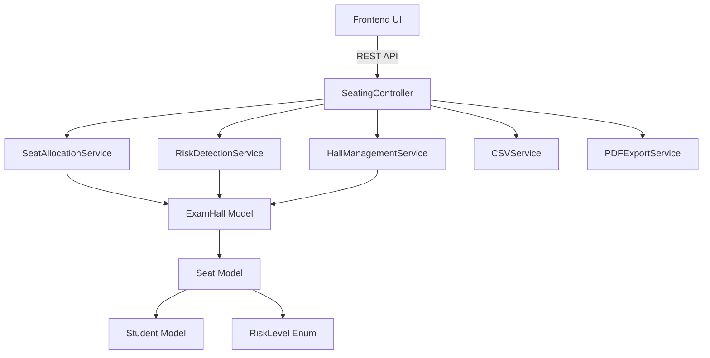
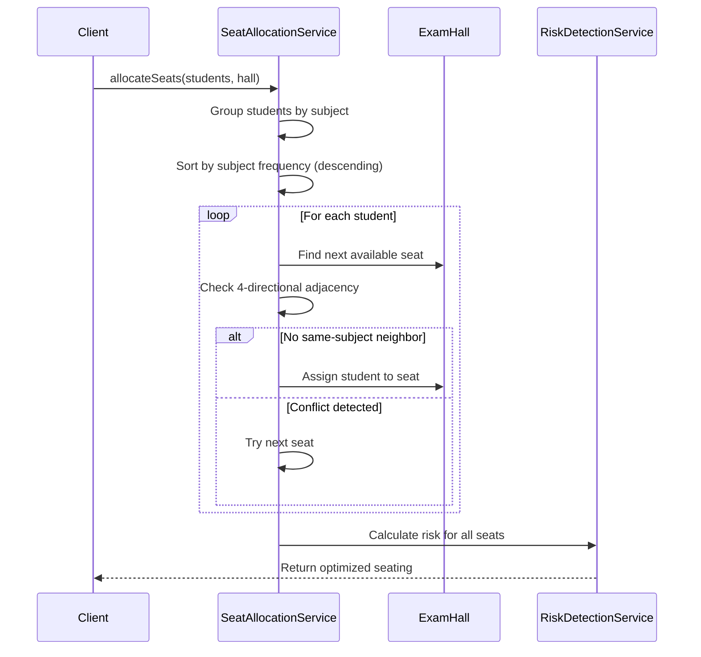
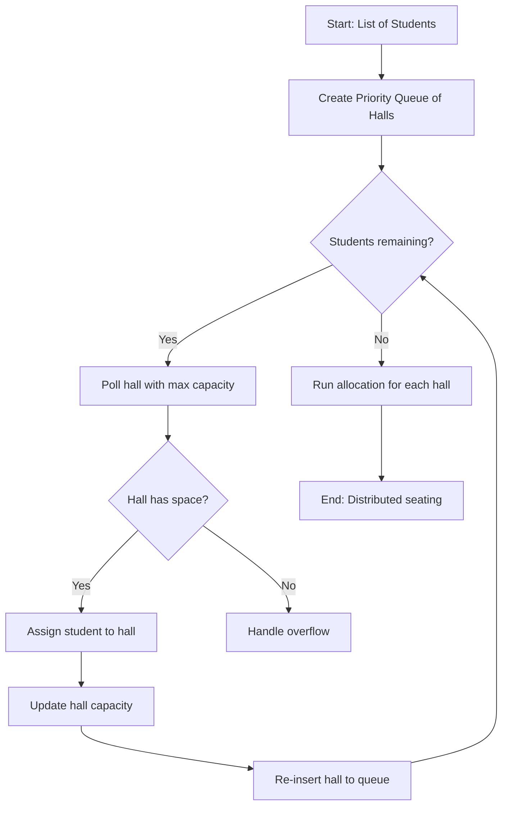
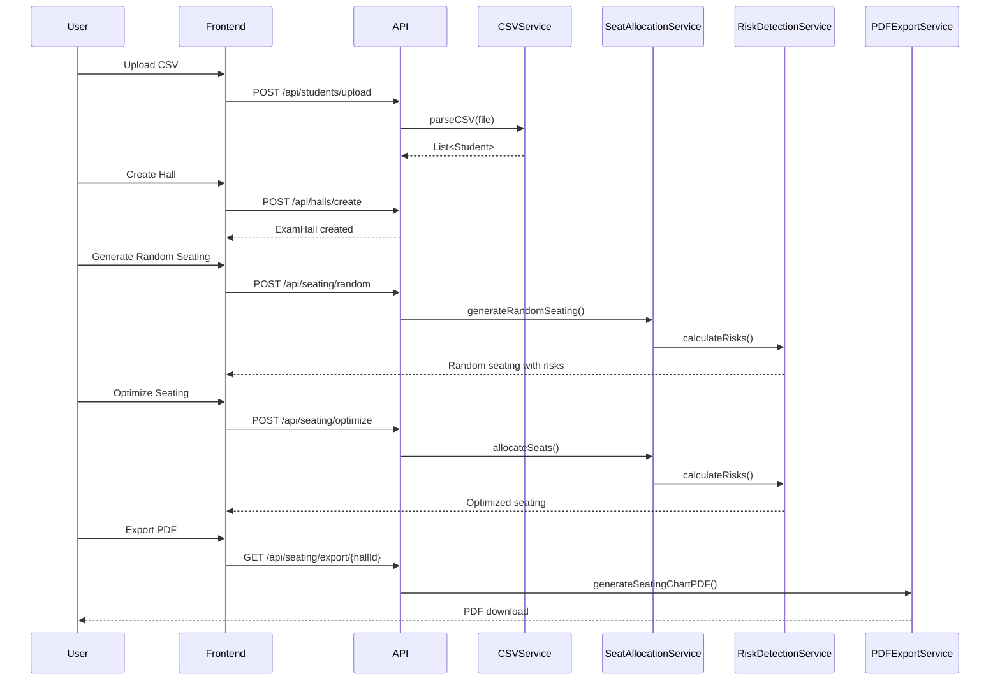

# System Architecture & DSA Algorithm Design

## Overview

This system implements an intelligent exam seating optimization solution using **Graph Coloring** and **Greedy Algorithms** to minimize cheating risks by ensuring students of the same subject are not seated adjacent to each other.

## Architecture Overview



## Core Domain Models

### Existing Models

All core domain models are already implemented in file:src/main/java/com/examseating/anticheating/model/:

- **Student** (file:src/main/java/com/examseating/anticheating/model/Student.java): `rollNo`, `name`, `subject`
- **Seat** (file:src/main/java/com/examseating/anticheating/model/Seat.java): `row`, `col`, `student`, `riskLevel`, `riskScore`
- **ExamHall** (file:src/main/java/com/examseating/anticheating/model/ExamHall.java): `hallId`, `rows`, `cols`, `seats[][]`
- **RiskLevel** (file:src/main/java/com/examseating/anticheating/model/RiskLevel.java): `SAFE(🟩)`, `MEDIUM(🟨)`, `HIGH(🟥)`

## DSA Algorithm Design

### 1. Graph Coloring Algorithm

**Problem Mapping:**

- **Nodes**: Students
- **Edges**: Same-subject relationship (conflict)
- **Colors**: Seat positions
- **Constraint**: Adjacent seats cannot have same-subject students

**Algorithm Flow:**



**Greedy Strategy:**

1. **Sort students** by subject frequency (most common subjects first)
2. **Traverse 2D seat array** row-by-row
3. For each seat, check **4 neighbors** (up, down, left, right)
4. Assign student only if **no same-subject adjacency**
5. Use **Queue** for student assignment flow

**Time Complexity:** O(n × m) where n = students, m = seats  
**Space Complexity:** O(n + m)

### 2. Risk Detection Algorithm

**Risk Calculation Logic:**

```
For each seat at (row, col):
  conflictCount = 0
  Check 4 neighbors (up, down, left, right):
    if neighbor.student.subject == current.student.subject:
      conflictCount++
  
  riskLevel = fromConflictCount(conflictCount)
  riskScore = (conflictCount / maxNeighbors) × 100
```

**Risk Level Mapping:**

- `conflictCount = 0` → **SAFE** (🟩 Green)
- `conflictCount = 1` → **MEDIUM** (🟨 Yellow)
- `conflictCount ≥ 2` → **HIGH** (🟥 Red)

**Total Hall Risk Score:**

```
totalRisk = Σ(seat.riskScore) / totalSeats
```

### 3. Multi-Hall Distribution Algorithm

**Priority Queue Strategy:**



**Distribution Logic:**

1. Use **Priority Queue** ordered by available capacity
2. Assign students to halls with most space first
3. Ensure **balanced distribution**
4. Handle **overflow scenarios** (students > total capacity)

## Service Layer Architecture

### SeatAllocationService

**Responsibilities:**

- Implement greedy graph coloring algorithm
- `allocateSeats(List<Student>, ExamHall)` - optimized allocation
- `generateRandomSeating(List<Student>, ExamHall)` - baseline comparison
- 4-directional adjacency validation

**Key Methods:**

- `isValidPlacement(Seat[][], int row, int col, Student)` - check conflicts
- `getAdjacentSeats(Seat[][], int row, int col)` - return 4 neighbors

### RiskDetectionService

**Responsibilities:**

- Calculate risk levels for individual seats
- Compute total hall risk score
- Generate before/after comparison metrics

**Key Methods:**

- `calculateRiskForSeat(Seat[][], int row, int col)` - 4-neighbor check
- `calculateTotalHallRisk(ExamHall)` - aggregate risk score
- `generateRiskReport(ExamHall)` - detailed analytics

### HallManagementService

**Responsibilities:**

- Manage multiple exam halls
- Distribute students across halls
- Handle capacity constraints

**Key Methods:**

- `distributeStudentsAcrossHalls(List<Student>, List<ExamHall>)`
- `getHallById(String hallId)`
- `createHall(String hallId, int rows, int cols)`

### CSVService

**Responsibilities:**

- Parse CSV files using Apache POI/OpenCSV
- Validate data integrity
- Convert to Student objects

**Expected CSV Format:**

```
RollNo,Name,Subject
2021001,John Doe,Mathematics
2021002,Jane Smith,Physics
```

**Key Methods:**

- `parseCSV(MultipartFile file)` - returns `List<Student>`
- `validateCSVStructure(String[][] data)` - data validation
- `handleParsingErrors()` - error reporting

### PDFExportService

**Responsibilities:**

- Generate seating chart PDFs using iText
- Color-coded seat visualization
- Include hall metadata and risk scores

**Key Methods:**

- `generateSeatingChartPDF(ExamHall)` - returns byte stream
- `renderSeatGrid(Document, ExamHall)` - 2D grid layout
- `addLegend(Document)` - risk level colors

## Data Flow



## REST API Endpoints


| Method | Endpoint                       | Description                        |
| ------ | ------------------------------ | ---------------------------------- |
| POST   | `/api/students/upload`         | Upload CSV file with student data  |
| POST   | `/api/students/manual`         | Manually add students              |
| POST   | `/api/halls/create`            | Create new exam hall configuration |
| POST   | `/api/seating/random`          | Generate random seating (baseline) |
| POST   | `/api/seating/optimize`        | Run greedy allocation algorithm    |
| GET    | `/api/seating/risk/{hallId}`   | Get risk analysis for hall         |
| GET    | `/api/seating/export/{hallId}` | Export seating chart as PDF        |


## DTOs (Data Transfer Objects)

### StudentDTO

```java
{
  "rollNo": "string",
  "name": "string",
  "subject": "string"
}
```

### HallDTO

```java
{
  "hallId": "string",
  "rows": "integer",
  "cols": "integer",
  "capacity": "integer"
}
```

### SeatingResponseDTO

```java
{
  "hallId": "string",
  "seats": "Seat[][]",
  "totalRiskScore": "double",
  "conflictCount": "integer",
  "occupiedSeats": "integer"
}
```

## Performance Considerations

1. **Algorithm Optimization**: Greedy approach ensures O(n×m) complexity
2. **Memory Management**: 2D array for efficient seat access
3. **Caching**: Consider caching hall configurations
4. **Batch Processing**: Handle large CSV files in chunks
5. **Async PDF Generation**: For large halls, use async processing

## Testing Strategy

1. **Unit Tests**: Core algorithm validation
2. **Edge Cases**: Empty halls, overflow scenarios, single-subject groups
3. **Performance Tests**: Large datasets (1000+ students)
4. **Integration Tests**: End-to-end API testing
5. **Test Fixtures**: Reproducible test data

## Dependencies

All dependencies are already configured in file:pom.xml:

- Spring Boot 3.2.1
- Lombok
- Apache POI 5.2.5
- OpenCSV 5.9
- iText7 7.2.5
- Spring Boot Test

## Configuration

Server configuration in file:src/main/resources/application.properties:

```properties
server.port=8080
spring.servlet.multipart.max-file-size=10MB
spring.servlet.multipart.max-request-size=10MB
```